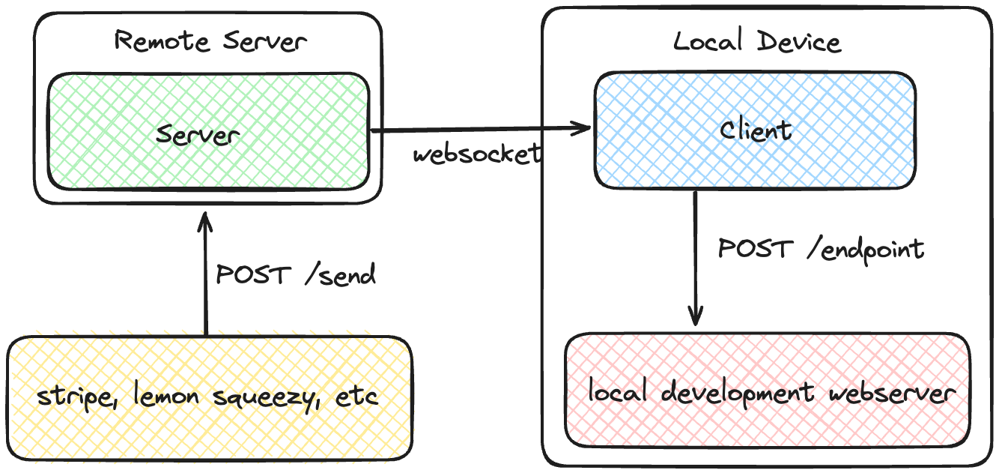

# Webhook Relay
An app to relay webhook requests from external services to your local development webserver.

I initially built this to test webhooks from payment processors like lemon squeezy locally.

### Architecture

### Usage
**Server**

To use the relay, on the remote service / payment processor add the url where the server is deployed.

`https://your-deployment.url/send`

**Client**

Set the address for the remote server to listen to and the (local) url to forward the request to.

Remote Server: `wss://your-deployment.url/ws`

Local URL: `http://localhost:<PORT>`

### Client Setup
**Install Dependencies**

`pip install websockets requests`

**Run the Script**

`python client.py`

### Server Setup
You can either use the deployment templates below or set it up manually

**Install Dependencies**

`pip install -r requirements.txt`

**Run the server**

`python server.py`

*if there is no `PORT` environment variable set, the server will be available on port `8900`*

### Deploy Server

### License 
MIT License

### Star History
